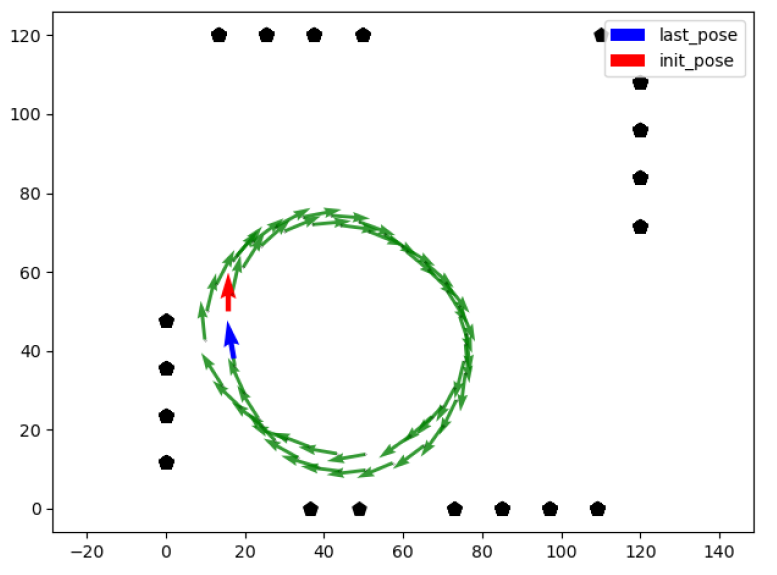

# Tracking of an Autonomous Robot Project

Tracking of an Autonomous Robot Project is a project work of [# ELEC-E8740 - Basics of sensor fusion D](https://mycourses.aalto.fi/course/search.php?search=ELEC-E8740) at Aalto University.

## Description
This project involves designing an algorithm for tracking an autonomous DiddyBorg rover robot using an array of sensors, including an Inertial Measurement Unit (IMU), infra-red detector, motor controller, and camera. The robot is programmed to follow a black line in a confined area. The IMU, consisting of an accelerometer, gyroscope, and magnetometer, is used to measure the robot's acceleration and angular rate. Although errors accrue over time, the camera system, which identifies QR coded rectangles, aids in correcting the position estimate obtained from the IMU data. All sensors are linked to a Raspberry Pi system, responsible for sensor data preprocessing, logging, and transmission.This project mainly uses the extended Kalman filter(EKF) algorithm.
For the detail please check [project_guide.pdf](./project_guide.pdf).

### Inrtoduction vedio
https://github.com/Exsusiai/Sensor_Fusion/assets/40732564/3910f615-af4d-4cac-9df7-7800d5ec47de

## Deploy
If you want to deploy this project, please follow the instructions in [DiddyBorg Sensor Fusion](./DiddyBorg_Sensor_Fusion-master/DiddyBorg_Sensor_Fusion-master/README.md).

## Running result
### Result of dead-reckoning

### Result of EKF

## Author

[Jingsheng Chen](mailto:chjingsheng@gmail.com)  @Aalto University

